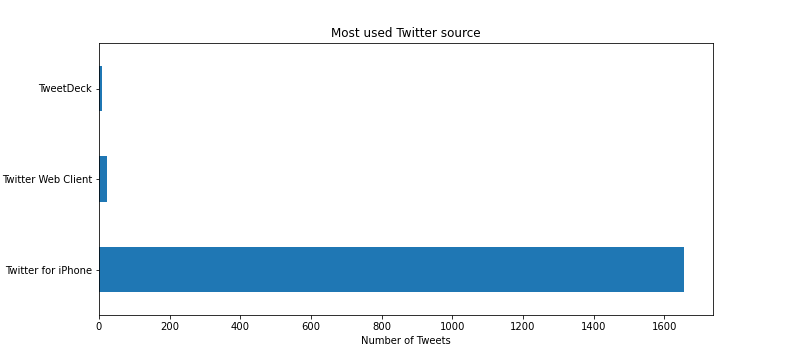
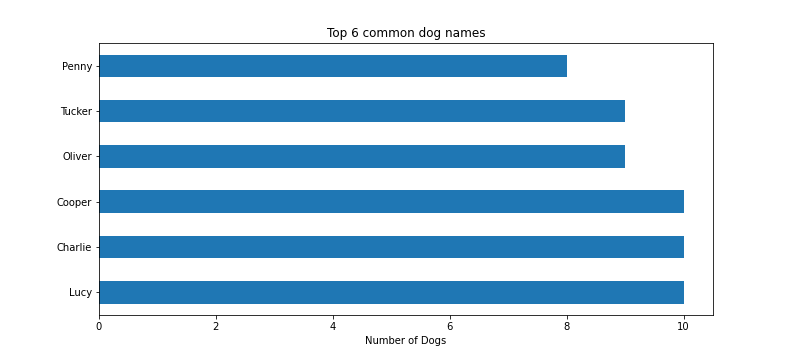
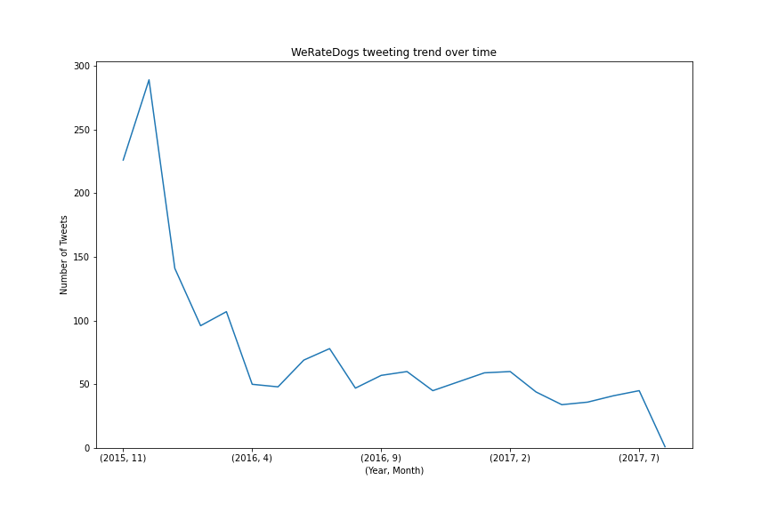
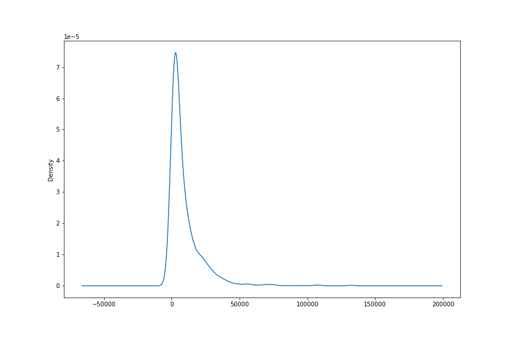
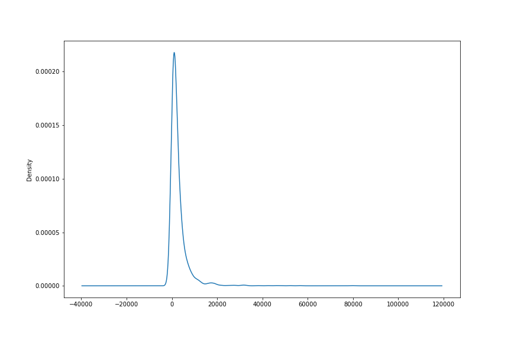
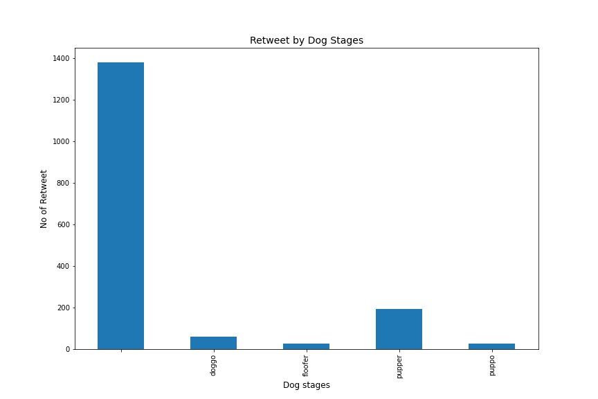
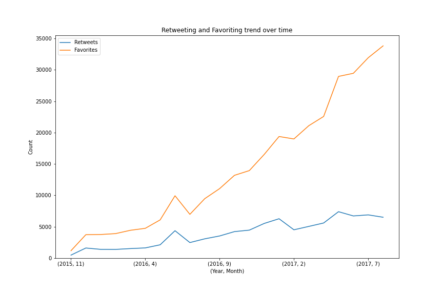

  

<h3 align="center"><a href = "https://www.udacity.com/course/data-analyst-nanodegree--nd002"> Udacity Data Analyst Nanodegree </a></h3>
<h4 align="center">Project IV: Wrangle and Analyze Data</h4>

## Table of Contents
- [Project Overview](#project_overview)
- [Installation](#installation)
- [Project Details](#details)
  - [Gathering Data](#gather)
  - [Assessing Data](#assess)
  - [Cleaning Data](#clean)
  - [Storing, Analyzing, and Visualizing](#sav)
  - [Report](#report)
- [Project Motivation](#motivation)
- [Results](#results)
- [Licensing, Authors, and Acknowledgements](#licensing)

### Project Overview 

Real-world data rarely comes clean. Using Python and its libraries, you will gather data from a variety of sources and in a variety of formats, assess its quality and tidiness, then clean it. This is called data wrangling. You will document your wrangling efforts in a Jupyter Notebook, plus showcase them through analyses and visualizations using Python (and its libraries) and/or SQL.

The dataset I'll be wrangling is the tweet archive of Twitter user @dog_rates (https://twitter.com/dog_rates), also known as WeRateDogs. This archive/dataset consists of 2356 basic tweet data from November, 2015 to August, 2017. WeRateDogs is a Twitter account that rates people's dogs with a humorous comment about the dog. Based on the images in the above dataset (i.e. WeRateDogs Twitter archive), another dataset is created which consists of image predictions (the top three only) alongside each tweet ID, image URL, and the image number that corresponded to the most confident prediction (numbered 1 to 4 since tweets can have up to four images). Though no wrangling will be done directly on this image predictions dataset, it will definitely provide some additional data for our main tweet archive dataset

WeRateDogs downloaded their Twitter archive and sent it to Udacity via email exclusively for you to use in this project. This archive contains basic tweet data (tweet ID, timestamp, text, etc.) for all 5000+ of their tweets as they stood on August 1, 2017. More on this soon.

  

### What Software Do I Need? 

The entirety of this project can be completed inside the Udacity classroom on the **Project Workspace: Complete and Submit Project** page using the Jupyter Notebook provided there. (Note: This Project Workspace may not be available in all versions of this project, in which case you should follow the directions below.)

If you want to work outside of the Udacity classroom, the following software requirements apply:
<ul>
    <li>You need to be able to work in a Jupyter Notebook on your computer. Please revisit our Jupyter Notebook and Anaconda tutorials earlier in the Nanodegree program for installation instructions.</li>
    <li>The following packages (libraries) need to be installed. You can install these packages via conda or pip. Please revisit our Anaconda tutorial earlier in the Nanodegree program for package installation instructions.</li>
  <ul>
        <li>pandas</li>
        <li>NumPy</li>
        <li>requests</li>
        <li>tweepy</li>
        <li>json</li>
    </ul>
    <li>You need to be able to create written documents that contain images and you need to be able to export these documents as PDF files. This task can be done in a Jupyter Notebook, but you might prefer to use a word processor like <a href="https://www.google.com/docs/about/">Google Docs</a>, which is free, or Microsoft Word.</li>
    <li>A text editor, like <a href="https://www.sublimetext.com/">Sublime</a>, which is free, will be useful but is not required.</li>
</ul>

### Project Details 

Your tasks in this project are as follows:
<ul>
    <li>Data wrangling, which consists of:</li>
  <ul>
        <li>Gathering data (downloadable file in the Resources tab in the left most panel of your classroom and linked in step 1 below).</li>
        <li>Assessing data</li>
        <li>Cleaning data</li>
    </ul>
    <li>Storing, analyzing, and visualizing your wrangled data</li>
    <li>Reporting on 1) your data wrangling efforts and 2) your data analyses and visualizations</li>
</ul>

#### Gathering Data for this Project 

Gather each of the three pieces of data as described below in a Jupyter Notebook titled `wrangle_act.ipynb`:
<ol>
    <li><s>File on hand - twitter_archive_enhanced.csv</s>
Using the link provided by Udacity, I downloaded the WeRateDogs Twitter archive manually as twitter_archive_enhanced.csv (https://d17h27t6h515a5.cloudfront.net/topher/2017/August/59a4e958_twitter-archiveenhanced/twitter-archive-enhanced.csv) file and imported this file into a dataframe (df).</li>

   <li><s>The tweet image predictions</s> i.e., what breed of dog (or other object, animal, etc.) is present in each tweet according to a neural network. This file (image_predictions.tsv) is hosted on Udacity's servers and should be downloaded programmatically using the <a href="https://pypi.org/project/requests/">Requests</a> library and the following URL: https://d17h27t6h515a5.cloudfront.net/topher/2017/August/599fd2ad_image-predictions/image-predictions.tsv</li>

   <li><s>Query of Twitter API - tweet_json.txt</s>
I couldn't get entrance into the twitter API so I downloaded a provided data from udacity server using python request</li>
</ol>

#### Assessing Data for this Project 

After gathering each of the above pieces of data, assess them visually and programmatically for quality and tidiness issues. Detect and document <strong>at least eight (8) quality issues</strong> and <strong>two (2) tidiness issues</strong> in your <em>wrangle_act.ipynb</em> Jupyter Notebook. To meet specifications, the issues that satisfy the Project Motivation (see the Key Points header on the previous page) must be assessed.

#### Cleaning Data for this Project 

Clean each of the issues you documented while assessing. Perform this cleaning in <em>wrangle_act.ipynb</em> as well. The result should be a high quality and tidy master pandas DataFrame (or DataFrames, if appropriate). Again, the issues that satisfy the Project Motivation must be cleaned.

#### Storing, Analyzing, and Visualizing Data for this Project 

Store the clean DataFrame(s) in a CSV file with the main one named <em>twitter_archive_master.csv</em>. If additional files exist because multiple tables are required for tidiness, name these files appropriately. Additionally, you may store the cleaned data in a SQLite database (which is to be submitted as well if you do).

Analyze and visualize your wrangled data in your <em>wrangle_act.ipynb</em> Jupyter Notebook. <strong>At least three (3) insights and one (1) visualization</strong> must be produced.

#### Reporting for this Project 

Create a <strong>300-600 word written report</strong> called <em>wrangle_report.pdf</em> or <em>wrangle_report.html</em> that briefly describes your wrangling efforts. This is to be framed as an internal document.

Create a <strong>250-word-minimum written report</strong> called <em>act_report.pdf</em> or <em>act_report.html</em> that communicates the insights and displays the visualization(s) produced from your wrangled data. 

#### Before you submit:

* Ensure you meet specifications for all items in the Project Rubric. Your project "meets specifications" only if it meets specifications for all of the criteria.
* Ensure you have not included your API keys, secrets, and tokens in your project files.
* If you completed your project in the Project Workspace, ensure the following files are present in your workspace, then click "Submit Project" in the bottom righthand corner of the Project Workspace page:
  * `wrangle_act.ipynb`: code for gathering, assessing, cleaning, analyzing, and visualizing data
  * `wrangle_report.pdf` or `wrangle_report.html`: documentation for data wrangling steps: gather, assess, and clean
  * `act_report.pdf` or `act_report.html`: documentation of analysis and insights into final data
  * `twitter_archive_enhanced.csv`: file as given
  * `image_predictions.tsv`: file downloaded programmatically
  * `tweet_json.txt`: file constructed via API
  * `twitter_archive_master.csv`: combined and cleaned data
  * any additional files (e.g. files for additional pieces of gathered data or a database file for your stored clean data)

### Project Motivation 

This is an Udacity Nanodegree project.I was interested in using Tweet Data to better understand:  
-  What is the total number of tweets over time to see whether that number increases, or decreases, over time.
- what is the retweet counts, and favorite counts comparison over time.
- What is the most popular dog breed.
- What is the most popular dog names.

## Results 
- Out of the 1994 tweets, 1955 were posted from iPhone. Just a confirmation that the only mobile device WeRateDogs uses to post tweets is an iPhone.
- the Pupper Dog stage is the most liked dog stage, as it has the highest number of favourite_count, followed by Doggo and Puppo and floofer being the least
- TWeRateDogs, a Twitter account started in 2015, tweeted a lot in its starting days. For example, it posted around 225 tweets in the month of November 2015, which increased to around 280 tweets in exactly the next month. However, its tweeting activity reduced drastically in the subsequent months, averaging between 50 to 100 since April, 2016.
- 11 of the dogs were named Charlie, Lucy, Cooper, Tucker are the most we have. A close second is Oliver, with 9 dogs being named as these.
- **Visualizations**

  
  
  
  
  
  
  
  

## Licensing, Authors, Acknowledgements
Must give credit to Udacity to providing this data. 
